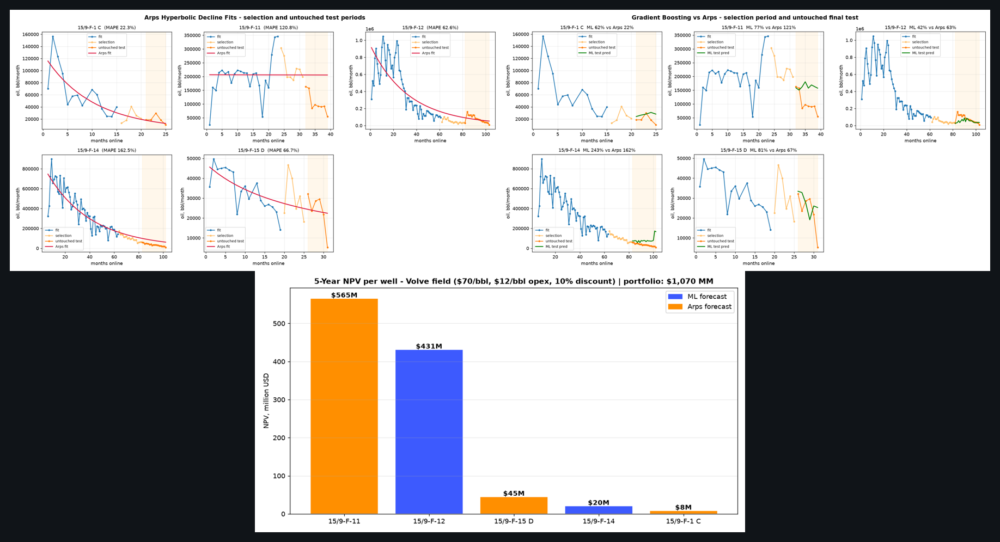
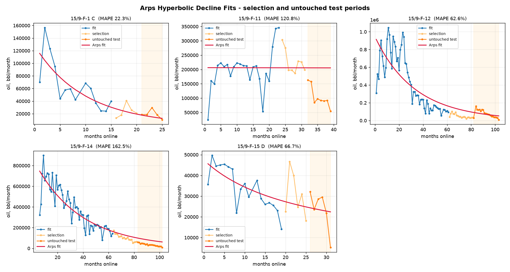
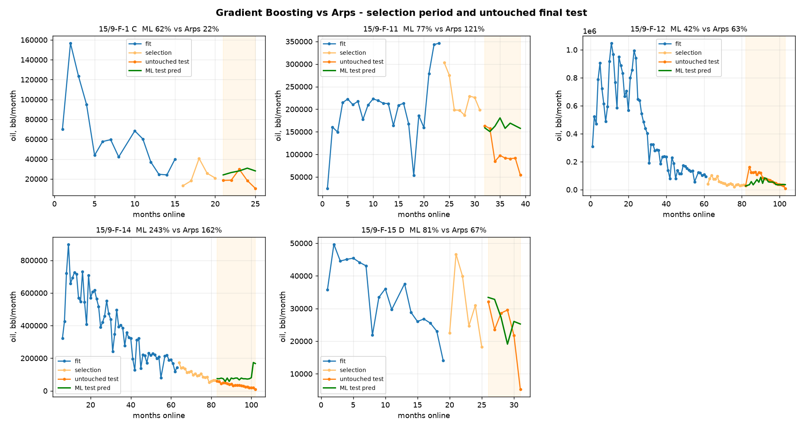
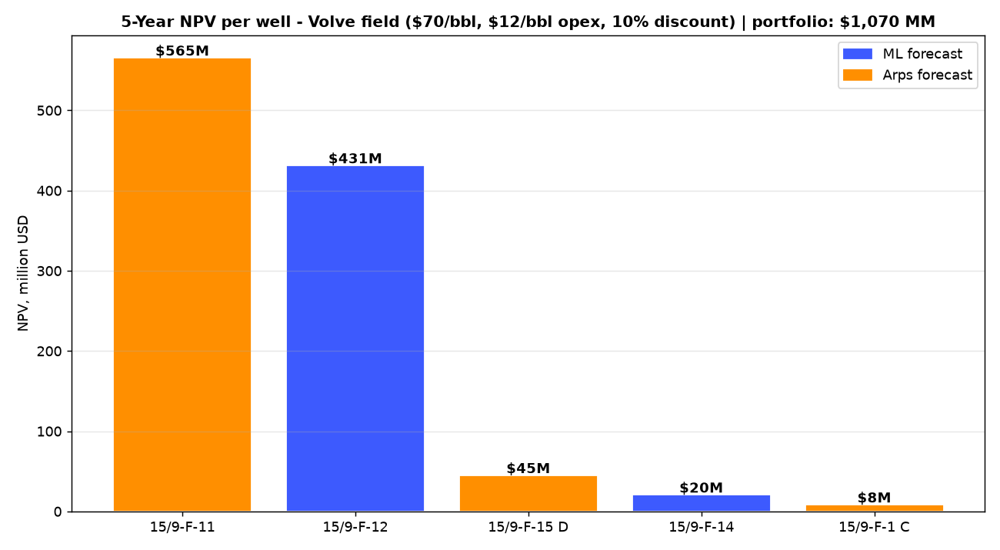

# Volve production forecasting prototype

This repository is a small, reproducible study of monthly oil production from
five producing wells in Equinor's public Volve dataset. It compares a
hyperbolic Arps decline curve with gradient boosting and simple last-value and
moving-average baselines. It is a methodological prototype, not a reserves
estimate or investment recommendation.

<p align="center">
  
</p>

*A project-produced overview: decline-curve fits, held-out forecast comparison,
and the simplified NPV scenario. Every panel is produced by the local pipeline;
there are no stock photos or decorative third-party images.*

## A quick visual tour

The figures below are deliberately report-like rather than promotional. They
show the evidence behind the prototype: how the decline curves track each
well, how the two forecasting approaches compare on time-ordered data, and how
the forecast flows into a clearly labelled operating-NPV scenario.

| Decline behaviour | Forecast comparison | Scenario economics |
|---|---|---|
| [](figures/arps_fits.png) | [](figures/ml_vs_arps.png) | [](figures/npv.png) |
| Hyperbolic fits with fit, selection, and untouched test periods. | ML and Arps are compared without reusing the final test labels for selection. | Five-year **simplified pre-tax operating NPV**, not an investment valuation. |

## Evaluation that does not reuse the final test

Each well is split in time: the first 60% fits models, the next 20% is the
**model-selection period**, and the last 20% is an untouched **final test
period**. The winner is selected only from the selection period. After that
choice is fixed, final-test MAE, RMSE, and MAPE are reported. The final
forecast model is then refit on all observed history for the five-year
scenario. MAPE is useful for comparing scale but can be unstable when actual
production is small; use MAE and RMSE as well.

## Uncertainty and economics

Forecast P10/P50/P90 bands use a residual bootstrap from the untouched test
errors. NPV is reported as **simplified pre-tax operating NPV**:

`discounted monthly oil × (oil price - variable opex)`

The dashboard lets you vary price, opex, and discount rate and includes a
price/opex sensitivity table. It does not model taxes, royalties, capex,
abandonment, facilities or downtime constraints, transport, water/gas
economics, or working capital. The default conversion is 1 Sm3 = 6.2898
stock-tank barrels. Units and input fields are described in
[DATA_DICTIONARY.md](DATA_DICTIONARY.md).

## Run

Use the single pipeline command from the repository root:

```bash
python run_pipeline.py
streamlit run app.py
```

The pipeline writes model metrics, forecasts, uncertainty bands, NPV scenarios,
and figures to `output/` and `figures/`. It expects the raw daily CSV at
`data/volve_daily_production.csv`. For a clean environment, install the pinned
runtime dependencies first:

```bash
python -m pip install -r requirements.txt
pytest -q
```

## Project files

`01_prepare.py` parses and aggregates daily records. `02_arps.py` fits and
evaluates Arps. `03_ml.py` evaluates ML and baselines, selects the winner, and
bootstraps forecast intervals. `04_economics.py` calculates scenario NPV.
`forecast_utils.py` contains tested unit conversion, metrics, discounting, and
interval helpers. `app.py` is the Streamlit report.

The source data is the Equinor Volve field data sharing release. See
`DATA_DICTIONARY.md` for source notes and processing choices. Results depend on
the supplied CSV and should not be presented as field-wide reserves or
investment advice.
